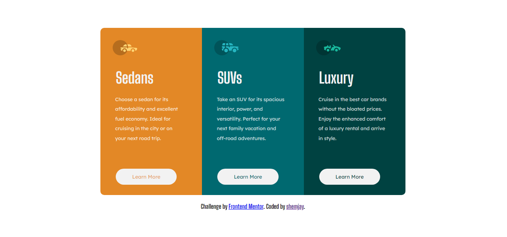

# Frontend Mentor - 3-column preview card component solution

This is a solution to the [3-column preview card component challenge on Frontend Mentor](https://www.frontendmentor.io/challenges/3column-preview-card-component-pH92eAR2-). Frontend Mentor challenges help you improve your coding skills by building realistic projects. 

## Table of contents

- [Overview](#overview)
  - [The challenge](#the-challenge)
  - [Screenshot](#screenshot)
  - [Links](#links)
- [My process](#my-process)
  - [Built with](#built-with)
  - [What I learned](#what-i-learned)
  - [Continued development](#continued-development)
  - [Useful resources](#useful-resources)
- [Author](#author)

## Overview

### The challenge

Users should be able to:

- View the optimal layout depending on their device's screen size
- See hover states for interactive elements

### Screenshot



### Links

- Solution URL: [Add solution URL here](https://github.com/shemjay/3-column-preview-card)
- Live Site URL: [Add live site URL here](https://shemjay.github.io/3-column-preview-card/)

## My process

### Built with

- Semantic HTML5 markup
- CSS custom properties
- Flexbox
- CSS Grid

**Note: These are just examples. Delete this note and replace the list above with your own choices**

### What I learned

1. I learned how to use blend mode to blend elements with their beackground color in specific ways. While I may not have used it in my final solution it was still very interesting to learn about.

2. Learned a bit more on how to style buttons in css:

```css
.flex-input {
    font-family: 'Lexend Deca';
    width: 60%;
    cursor: pointer;
    background-color: hsl(0, 0%, 95%);
    color: hsla(0, 0%, 100%, 0.75);
    outline: none;
    padding: 1em;
    margin-left: 3em;
    margin-top: 4em;
    border-radius: 25px;
    border: none;
}
```

### Continued development

How to properly position elements within flex children. I still use very unprofessional methods to position text and images in flex children. Still getting the hang of it.


### Useful resources

- [CSS tricks blend mode properties](https://css-tricks.com/almanac/properties/m/mix-blend-mode/) - This site helps give a really good understanding of how to use css blend mode and all the differnt css blend mode properties.

## Author

- Github - [shemjay](https://github.com/shemjay)
- Frontend Mentor - [@shemjay](https://www.frontendmentor.io/profile/shemjay)
- Twitter - [@shemstack](https://www.twitter.com/shemstack)

